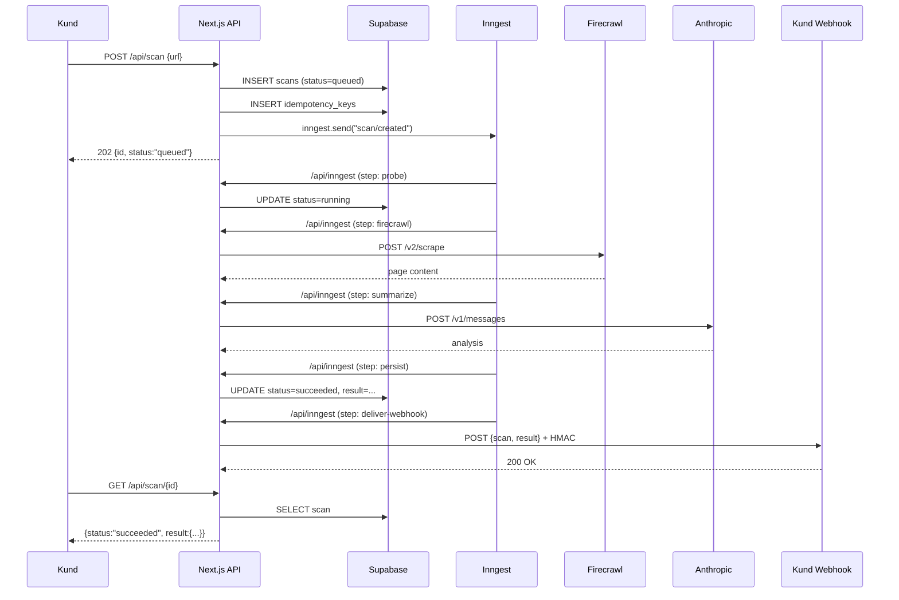

# 5. Async API-arkitektur för agent.opensverige.se

> **Kontext:** Varje scan-jobb tar 10–30 sekunder. Synkron HTTP-respons är ohållbart vid skala. Det här dokumentet designar ett produktionsredo async-API med pålitliga webhooks, idempotency, kömotor och konkret TypeScript-implementation — redo att gå rakt in i Claude Code.

---

## 5.1 Mönsterjämförelse — hur gör de andra?

### Sammanfattningstabell

| Tjänst | Submit | Status-poll | Webhook | Idempotens | Auth |
|---|---|---|---|---|---|
| **Replicate** | `POST /v1/predictions` → 202 | `GET /v1/predictions/{id}` | HTTPS POST, filtrerbar per event | Ej dokumenterat | `Bearer` token |
| **WebPageTest** | `POST /runtest.php` → `testId` | `GET /testStatus.php?test={id}` | `pingback` URL-param | Ej dokumenterat | `X-WPT-API-KEY` header |
| **VirusTotal v3** | `POST /files` / `POST /urls` → `analysisId` | `GET /analyses/{id}` | Ej inbyggt | Ej dokumenterat | `x-apikey` header |
| **URLScan.io** | `POST /api/v1/scan/` → `uuid` | `GET /api/v1/result/{uuid}` (404 tills klar) | Ej inbyggt | Ej dokumenterat | `API-Key` header |
| **Stripe Files + Events** | `POST /files` → `id` | `GET /events/{id}` | HMAC-SHA256, `Stripe-Signature` | `Idempotency-Key` header, 24h | `Bearer` secret key |
| **Anthropic Batches** | `POST /v1/messages/batches` → batch object | `GET /v1/messages/batches/{id}` | Ej inbyggt | Ej dokumenterat | `x-api-key` header |
| **OpenAI Batch** | `POST /v1/batches` → batch object | `GET /v1/batches/{id}` | Ej inbyggt | Ej dokumenterat | `Bearer` token |
| **Firecrawl Async** | `POST /v2/crawl` → `id` | `GET /v2/crawl/{id}` | HMAC-SHA256, `X-Firecrawl-Signature` | Ej dokumenterat | `Authorization: Bearer` |
| **Browserbase Functions** | `POST /v1/functions/{id}/invoke` → invocation | `GET /v1/functions/invocations/{id}` | Ej inbyggt | Ej dokumenterat | `x-bb-api-key` header |

---

### Replicate Predictions API

[Replicates HTTP-dokumentation](https://replicate.com/docs/reference/http) beskriver ett av de mest väldesignade async-API:erna i branschen. En `POST /v1/predictions` returnerar omedelbart ett prediction-objekt med `status: "starting"` och ett `urls.get`-fält som pekar på poll-URL:en. Klienten kan antingen polla eller registrera en webhook-URL i request-bodyn.

**API-shape:**
```json
POST /v1/predictions
{
  "version": "<model-version-id>",
  "input": { "prompt": "..." },
  "webhook": "https://example.com/hooks/replicate",
  "webhook_events_filter": ["start", "completed"]
}
→ 202 Accepted
{
  "id": "gm3qorzdhgbfurvjtvhg6dckhu",
  "status": "starting",
  "urls": {
    "get": "https://api.replicate.com/v1/predictions/gm3qorzdhgbfurvjtvhg6dckhu",
    "cancel": "https://api.replicate.com/v1/predictions/gm3qorzdhgbfurvjtvhg6dckhu/cancel"
  },
  "created_at": "2024-01-01T00:00:00Z"
}
```

**Status-machine:** `starting → processing → succeeded | failed | canceled`. Webhook-filtret `webhook_events_filter` gör att klienten bara får notifiering på önskade events — ett elegant sätt att minska chattigheten. `Prefer: wait=N` (1–60s) möjliggör synkron fallback för snabba modeller. Rate limit: 600 predictions/min.

---

### WebPageTest API

[WebPageTests API-referens](https://docs.webpagetest.org/api/reference/) använder ett numeriskt statuskod-system snarare än named states. En `POST /runtest.php` returnerar ett `testId` och klienten pollar `/testStatus.php?test={id}`.

**Status-koder:** `100` (started) → `101` (queued) → `200` (complete) / `400` (not found) / `402` (cancelled). `pingback`-parametern i submit-requesten är ett enkelt webhook-alternativ utan HMAC — testet-ID skickas som query-parameter till den angivna URL:en. Ingen request-body i notifieringen, vilket gör verifiering svårare.

---

### VirusTotal API v3

[VirusTotal scan-endpoint](https://docs.virustotal.com/reference/scan-url) returnerar ett `Analysis ID` direkt. Polling sker mot `/analyses/{id}`. Tjänsten har inget inbyggt webhook-stöd — kunden måste polla eller bygga sin egen polling-infrastruktur. Auth via `x-apikey` header.

---

### URLScan.io API

[URLScans API-dokumentation](https://urlscan.io/docs/api/) illustrerar ett intressant mönster: `GET /result/{uuid}` returnerar `404` medan jobbet körs och `200` när det är klart. Status-machine är implicit snarare än explicit — 200 = done, 404 = in progress, 410 = deleted. Rekommenderat polling-intervall: vänta 10–30s, sedan 5s intervall. Inga webhooks.

---

### Stripe Files API + Stripe Events

[Stripe idempotency-dokumentation](https://stripe.com/docs/api/idempotent_requests) och Stripes webhook-system är industri-referensen för async API-design. `Idempotency-Key`-headern (upp till 255 tecken, rekommenderat V4 UUID) lagras i 24 timmar. Duplicerade requests med samma key returnerar cachat svar — inklusive `500`-fel. `409 Conflict` returneras om key återanvänds med *annorlunda* parameters.

Webhook-systemet använder `Stripe-Signature`-headern (timestamp + HMAC-SHA256) med 5-minuters toleransfönster. Retry-policy: upp till 3 dagar med exponential backoff i production. Manuell resend möjlig upp till 30 dagar.

---

### Anthropic Message Batches API

[Anthropic batches-endpoint](https://docs.anthropic.com/en/api/creating-message-batches) accepterar upp till 50 000 requests per batch. Batch-objekt har `processing_status`: `in_progress → canceling | ended`. Results levereras som `.jsonl` via `results_url` när `ended`. TTL: 24 timmar (`expires_at`). Inga webhooks — kunder måste polla. `custom_id` per request möjliggör matchning av svar mot ursprungsrequest.

---

### OpenAI Batch API

[OpenAIs Batch API](https://platform.openai.com/docs/guides/batch) kräver att input laddas upp som `.jsonl`-fil via Files API (purpose: `"batch"`) innan batch skapas. Status-machine: `validating → failed | in_progress → finalizing → completed | expired | cancelling → cancelled`. Output-filen raderas automatiskt efter 30 dagar. 50% kostnadsrabatt vs synkron API. Max 50 000 requests/batch, 200 MB/fil.

---

### Firecrawl Async Crawl

[Firecrawls crawl-dokumentation](https://docs.firecrawl.dev/features/crawl) är ett modernt exempel på async API med inbyggt webhook-stöd. `POST /v2/crawl` returnerar ett `id` och URL för polling. Webhook-objektet i request-bodyn specificerar URL, events (`started`, `page`, `completed`, `failed`) och godtycklig metadata. Signering via `X-Firecrawl-Signature` (HMAC-SHA256). Results paginas med `next`-parameter och är tillgängliga 24 timmar.

---

### Browserbase Functions

[Browserbase Functions-plattformen](https://docs.browserbase.com/platform/runtime/overview) är ett serverless browser-execution-system. Invoke via `POST /v1/functions/{functionId}/invoke`, status pollas via `GET /v1/functions/invocations/{invocationId}`. Status: `COMPLETED`. Inga inbyggda webhooks — förväntas anropas synkront eller ha polling-loop. Sessions kan vara `keepAlive: true` med custom timeout (upp till 3600s).

---

## 5.2 Standard-kontraktet för "slow async behind public API"

### Typiska shapes

```
POST /scan
Content-Type: application/json
Authorization: Bearer <api_key>
Idempotency-Key: <uuid-v4>

{ "url": "https://example.com", "options": {} }

→ 202 Accepted
Location: /api/scan/scan_01JZABC123DEF
Retry-After: 5

{
  "id": "scan_01JZABC123DEF",
  "status": "queued",
  "created_at": "2025-01-01T12:00:00Z",
  "estimated_duration_ms": 15000,
  "_links": {
    "self": "/api/scan/scan_01JZABC123DEF",
    "cancel": "/api/scan/scan_01JZABC123DEF/cancel"
  }
}
```

```
GET /api/scan/{id}
Authorization: Bearer <api_key>

→ 200 OK
{
  "id": "scan_01JZABC123DEF",
  "status": "running",
  "progress": { "step": "firecrawl", "percent": 40 },
  "created_at": "2025-01-01T12:00:00Z",
  "started_at": "2025-01-01T12:00:02Z",
  "completed_at": null,
  "result": null,
  "error": null
}
```

### Lifecycle states

```
                    ┌──────────┐
                    │  queued  │ ← POST /scan (202)
                    └────┬─────┘
                         │ worker picks up
                    ┌────▼─────┐
                    │ running  │
                    └──┬───┬───┘
           success     │   │ error
            ┌──────────┘   └──────────┐
       ┌────▼──────┐           ┌──────▼───┐
       │ succeeded │           │  failed  │
       └────┬──────┘           └──────────┘
            │ no webhook delivery
       ┌────▼──────┐
       │  expired  │ ← TTL passerat (72h)
       └───────────┘

Manuellt avbruten:           cancelled
Worker slog i timeout:       failed (retriable)
```

| State | Terminal | Webhook skickas |
|---|---|---|
| `queued` | Nej | Nej |
| `running` | Nej | Nej (eller optional `started`) |
| `succeeded` | Ja | Ja |
| `failed` | Ja | Ja |
| `expired` | Ja | Nej (TTL-städning) |
| `cancelled` | Ja | Ja (optional) |

### Polling-rekommendationer

Klienten bör följa `Retry-After`-headern. Saknas den, implementera exponential backoff:

```typescript
async function pollScan(scanId: string, apiKey: string) {
  const delays = [1, 2, 4, 8, 15, 30, 30]; // sekunder
  for (const delay of delays) {
    await sleep(delay * 1000);
    const res = await fetch(`/api/scan/${scanId}`, {
      headers: { Authorization: `Bearer ${apiKey}` },
    });
    const scan = await res.json();
    if (["succeeded", "failed", "cancelled", "expired"].includes(scan.status)) {
      return scan;
    }
  }
  throw new Error("Max poll-attempts exceeded");
}
```

**Best practices:** Initial väntetid 1s, dubbling per försök, max intervall 30s, max total tid 5 min.

### TTL för results

| Data | TTL | Motivering |
|---|---|---|
| Scan-metadata (DB-rad) | 90 dagar | Compliance, audit log |
| Full result-payload | 30 dagar | Lagringskostnad |
| Idempotency-records | 24 timmar | Stripe-mönster |
| Webhook delivery log | 7 dagar | Debuggning |

---

## 5.3 Idempotens

### Idempotency-Key header — Stripe-mönster

Klienten genererar ett V4 UUID och skickar det i `Idempotency-Key`-headern. Servern sparar `(key, user_id, request_hash, response_status, response_body)` i en `idempotency_keys`-tabell. Cachade svar levereras utan att ett nytt jobb skapas.

```typescript
// Middleware: idempotency check
async function withIdempotency(req: Request, handler: () => Promise<Response>) {
  const key = req.headers.get("Idempotency-Key");
  if (!key) return handler(); // Idempotency är valfritt

  const existing = await db
    .selectFrom("idempotency_keys")
    .where("key", "=", key)
    .where("user_id", "=", ctx.userId)
    .selectAll()
    .executeTakeFirst();

  if (existing) {
    // Returnera cachat svar
    return new Response(existing.response_body, {
      status: existing.response_status,
      headers: { "Idempotency-Replayed": "true" },
    });
  }

  // Lagra placeholder (förhindrar race condition)
  await db.insertInto("idempotency_keys").values({
    key,
    user_id: ctx.userId,
    request_hash: hashRequest(req),
    created_at: new Date(),
  }).execute();

  const response = await handler();
  
  // Uppdatera med svar
  await db.updateTable("idempotency_keys")
    .set({
      response_status: response.status,
      response_body: await response.clone().text(),
    })
    .where("key", "=", key)
    .execute();

  return response;
}
```

### Hur länge lagras idempotency-records?

[Stripe lagrar keys i 24 timmar](https://stripe.com/docs/api/idempotent_requests) — efter det behandlas en återanvänd key som en ny request. 24h är rimligt för API-calls; vid kritiska finansiella transaktioner kan man gå upp till 7 dagar.

### Race conditions och 409 Conflict

Om `request_hash` inte matchar den lagrade — dvs. klienten återanvänder en key med *andra* parametrar — returnera `409 Conflict`:

```typescript
if (existing && existing.request_hash !== hashRequest(req)) {
  return new Response(JSON.stringify({
    error: "idempotency_conflict",
    message: "Idempotency-Key reused with different parameters",
  }), { status: 409 });
}
```

Om en request är under behandling (placeholder finns men inget svar ännu) — returnera `409` med `Retry-After: 1` för att signalera att klienten ska försöka igen.

### Replay-säkerheten

Idempotens gäller `POST /scan`. `GET`- och `DELETE`-endpoints är per definition idempotenta och behöver ingen key.

---

## 5.4 Webhook-säkerhet

### HMAC-SHA256 signing

Alla tre stora providers använder HMAC-SHA256 men med olika header-format:

| Provider | Header | Format |
|---|---|---|
| Stripe | `Stripe-Signature` | `t=<timestamp>,v1=<sig>` |
| GitHub | `X-Hub-Signature-256` | `sha256=<sig>` |
| Slack | `X-Slack-Signature` | `v0=<sig>` |
| Firecrawl | `X-Firecrawl-Signature` | `<sig>` (raw hex) |
| **agent.opensverige** | `X-Opensverige-Signature` | `t=<timestamp>,v1=<sig>` |

Vi följer Stripe-mönstret (timestamp + signature i samma header) eftersom det gör replay-skyddet inbyggt.

### Implementation

```typescript
// Signera webhook (server-side, vid leverans)
function signWebhook(payload: string, secret: string): string {
  const timestamp = Math.floor(Date.now() / 1000);
  const signedPayload = `${timestamp}.${payload}`;
  const sig = crypto
    .createHmac("sha256", secret)
    .update(signedPayload)
    .digest("hex");
  return `t=${timestamp},v1=${sig}`;
}

// Verifiera webhook (kund-side, vid mottagning)
export function verifyWebhookSignature(
  payload: string,
  header: string,
  secret: string,
  toleranceSeconds = 300 // 5 minuter
): boolean {
  const parts = Object.fromEntries(
    header.split(",").map((p) => p.split("=") as [string, string])
  );
  const timestamp = parseInt(parts.t, 10);
  const signature = parts.v1;

  // Replay-skydd: avvisa om timestamp är äldre än 5 min
  const now = Math.floor(Date.now() / 1000);
  if (Math.abs(now - timestamp) > toleranceSeconds) {
    throw new Error("Webhook timestamp outside tolerance window");
  }

  const signedPayload = `${timestamp}.${payload}`;
  const expectedSig = crypto
    .createHmac("sha256", secret)
    .update(signedPayload)
    .digest("hex");

  // Timing-safe comparison
  return crypto.timingSafeEqual(
    Buffer.from(signature, "hex"),
    Buffer.from(expectedSig, "hex")
  );
}
```

### Timestamp + replay-skydd

5-minutersfönstret (som Stripe använder) är en balans mellan klockor som driftar och säkerhet. Utöver timestamp-kontrollen bör man spara och deduplicera webhook delivery IDs i Redis/DB med 10-minutersTTL för att fånga duplikat inom fönstret.

### Retry-policy

```
Attempt 1:  0s  delay   (omedelbart)
Attempt 2:  30s delay
Attempt 3:  5m  delay
Attempt 4:  30m delay
Attempt 5:  2h  delay
Attempt 6:  8h  delay
Attempt 7:  24h delay   (sista)
```

Exponential backoff med jitter (`delay * (0.8 + Math.random() * 0.4)`) för att undvika thundering herd. Efter max retries → dead-letter queue (DLQ) i Supabase-tabell.

### Webhook secret rotation

```sql
-- Lägg till nytt secret, behåll gammalt under övergångsperiod
ALTER TABLE webhooks ADD COLUMN secret_new TEXT;
ALTER TABLE webhooks ADD COLUMN secret_rotation_expires_at TIMESTAMPTZ;

-- Verifiera mot båda secrets under rotation
```

```typescript
function verifyWithRotation(payload: string, header: string, webhook: Webhook): boolean {
  try {
    return verifyWebhookSignature(payload, header, webhook.secret);
  } catch {
    if (webhook.secret_new && webhook.secret_rotation_expires_at > new Date()) {
      return verifyWebhookSignature(payload, header, webhook.secret_new);
    }
    return false;
  }
}
```

Rotationsperioden bör vara 24–48 timmar för att ge kunder tid att uppdatera.

### Webhook test/replay-UI

```
POST /api/webhooks/test
{
  "webhook_id": "wh_123",
  "event_type": "scan.completed",
  "scan_id": "scan_01JZABC"   // valfritt, annars syntetisk payload
}

→ 200 OK
{
  "delivery_id": "wdel_789",
  "status": "delivered",   // eller "failed"
  "response_status": 200,
  "response_body": "ok",
  "duration_ms": 142
}
```

Replay av befintlig delivery:
```
POST /api/webhooks/deliveries/{delivery_id}/replay
```

---

## 5.5 Vercel-specifika constraints

### Function timeouts per plan (2025–2026)

[Vercel funktions-dokumentation](https://vercel.com/docs/functions/configuring-functions/duration) anger följande gränser med Fluid Compute aktiverat (default sedan april 2025):

| Plan | Default max duration | Maximum (Fluid Compute) |
|---|---|---|
| Hobby | 300s (5 min) | 300s (5 min) |
| Pro | 300s (5 min) | 800s (~13 min) |
| Enterprise | 300s (5 min) | 800s (~13 min) |

*Historiska värden (projekt deployade före 23 april 2025, utan Fluid Compute): Hobby 60s, Pro 300s, Enterprise 900s.*

Konfigureras i route-handler:
```typescript
// app/api/inngest/route.ts
export const maxDuration = 300; // sekunder
```

### Edge vs Node runtime

| Dimension | Edge runtime | Node.js runtime |
|---|---|---|
| Cold start | <10ms | 250–800ms |
| Max duration | 25s (sedan kan streaming fortsätta 300s) | 300–800s beroende på plan |
| Timeout (response start) | 25s | N/A |
| Node.js-moduler | Ej tillgängliga | Fullständigt stöd |
| Supabase JS (native) | Begränsat | Fullt |
| BullMQ Worker | Omöjligt | Möjligt |
| Streaming (SSE) | Möjligt via waitUntil | Fullt stöd |
| Kod-storleksgräns | 1–4 MB | Praktiskt obegränsat |

> **Rekommendation:** API-routes (`/api/scan`, `/api/webhooks`) → Node.js runtime. Middleware (rate limiting, auth) → Edge runtime.

Edge runtime [rekommenderas inte längre av Vercel](https://vercel.com/docs/functions/runtimes/edge) för de flesta use cases — migrera till Node.js för bättre reliability.

### Fluid Compute

[Fluid Compute](https://vercel.com/docs/fluid-compute) (lanserat tidigt 2025, default för nya projekt) förändrar execution-modellen:

- **Concurrent requests per instans:** En varm instans hanterar flera requests parallellt (istället för 1-request-per-container)
- **Bytecode caching:** V8-kompilerat JS cachas across invocations → lägre cold start-kostnad för stora Next.js-appar
- **Background processing via `waitUntil`:** Kör kod efter HTTP-response är skickad
- **Scale to Zero-gap:** "Scale to One" på Pro/Enterprise håller minst en varm instans (upp till 14 dagar sedan senaste request)

```typescript
import { waitUntil } from "@vercel/functions";

export async function POST(req: Request) {
  const body = await req.json();
  
  // Returnera 202 omedelbart
  const scanId = createScanId();
  
  // Kör vidare i bakgrunden — men OBS: inga garantier, ingen retry
  // Använd detta ENBART för icke-kritiskt arbete (t.ex. analytics)
  waitUntil(logScanCreated(scanId));
  
  return new Response(JSON.stringify({ id: scanId, status: "queued" }), {
    status: 202,
  });
}
```

> **Viktigt:** `waitUntil` är fire-and-forget utan retry. Använd Inngest/Trigger.dev för kritiska jobb.

### Vercel Functions max payload

Från [Inngest provider limits](https://www.inngest.com/docs/usage-limits/providers): Vercel tillåter 4–4.5 MB payload. Response-body bör komprimeras för stora scan-resultat.

### Streaming (SSE)

```typescript
// app/api/scan/[id]/stream/route.ts
export const dynamic = "force-dynamic";

export async function GET(req: Request, { params }: { params: { id: string } }) {
  const encoder = new TextEncoder();
  
  const stream = new ReadableStream({
    async start(controller) {
      const sendEvent = (data: object) => {
        controller.enqueue(encoder.encode(`data: ${JSON.stringify(data)}\n\n`));
      };
      
      // Polla DB och skicka SSE-events
      let attempts = 0;
      while (attempts < 60) {
        const scan = await getScan(params.id);
        sendEvent({ status: scan.status, progress: scan.progress });
        
        if (["succeeded", "failed", "cancelled"].includes(scan.status)) {
          controller.close();
          return;
        }
        
        await sleep(2000);
        attempts++;
      }
      controller.close();
    },
  });
  
  return new Response(stream, {
    headers: {
      "Content-Type": "text/event-stream",
      "Cache-Control": "no-cache",
      "Connection": "keep-alive",
    },
  });
}
```

### Var det går snett vid bursts

1. **Cold start-kaskad:** 100 simultana requests → 100 nya instanser → kö hos Supabase/Anthropic
2. **BullMQ Worker dör:** Worker körs i Vercel Function-kontext → dör vid timeout → jobb fastnar
3. **Payload > 4.5 MB:** Vercel kastar 413 — kompressa eller paginera scan-resultat
4. **Inngest checkpointing-miss:** Om Vercel-funktionen dör mitt i ett steg → Inngest retransmitterar → idempotens i varje steg krävs

---

## 5.6 Kömotor-jämförelse

### Inngest

**[Inngest](https://www.inngest.com/)** kör kod på din egna infrastruktur (Vercel), Inngest sköter orchestration. Functions definieras med `inngest.createFunction()` och innehåller steg (`step.run()`). Varje steg är durable — om Vercel-funktionen dör mitt i ett steg, retransmitteras requesten.

| Dimension | Värde |
|---|---|
| Pris | Free: 50k executions/mån. Pro: $75/mån + $0.00002/execution. Enterprise: custom |
| Max job duration | Obegränsat (checkpointing per steg) |
| Max step duration | 300s (Vercel Pro maxDuration) |
| Throughput | Hög — distribueras över din Vercel-infrastruktur |
| Observability | Dashboard, traces, logs, alerting |
| Next.js-integration | Förstklassig — `serve()` från `inngest/next` |
| Vercel-fit | Optimal — designat för serverless |
| Vendor lock-in | SDK-beroende (TypeScript, Python, Go) |
| Concurrency (Pro) | 100+ concurrent steps |

**Nackdel:** Executions kör på din infrastruktur → Vercel-timeouts begränsar enskilt steg. Checkpointing löser detta men kräver att varje steg är <300s.

---

### Trigger.dev v3

**[Trigger.dev v3](https://trigger.dev/)** kör kod på *deras* managed compute — eliminerar Vercel-timeouts helt. Apache 2.0, open source, kan self-hostas.

| Dimension | Värde |
|---|---|
| Pris | Free: $5 usage/mån. Hobby: $10/mån + usage. Pro: $50/mån + $0.000025/invocation + compute |
| Compute (Small 1x default) | $0.0000338/sek = $2/timme |
| Max job duration | Obegränsat (kör på deras infrastruktur) |
| Throughput | Pro: 100+ concurrent runs |
| Observability | Dashboard, realtime API, React hooks |
| Next.js-integration | Bra — `@trigger.dev/sdk`, separata workers |
| Vercel-fit | Decoupled — workers körs hos Trigger, API-routes hos Vercel |
| Vendor lock-in | SDK-beroende (TypeScript-native) |
| Log retention (Pro) | 30 dagar |

**Fördel:** Ingen timeout-oro. Playwright/Puppeteer/Firecrawl stöds nativt. **Nackdel:** Workers deployar separat från Vercel — extra CI/CD-steg.

---

### Cloudflare Queues + Workers + Durable Objects

**[Cloudflare Queues](https://developers.cloudflare.com/queues/)** är ett managed message queue med Cloudflare Workers som consumers. Durable Objects ger stateful coordination.

| Dimension | Värde |
|---|---|
| Pris | $5/mån Workers Paid. Queues: 1M ops/mån inkluderade, sedan $0.40/milj |
| Max CPU per Worker invocation | 5 min (standard) / 15 min (Queue consumer / Cron) |
| Throughput | Mycket hög — Cloudflare-nätverk |
| Message retention | 4 dagar (default), max 14 dagar |
| Observability | Cloudflare dashboard, Workers Logs |
| Next.js-integration | Ingen officiell integration — kräver separata Workers |
| Vercel-fit | Dålig — olika ekosystem, dubbel deployment |
| Vendor lock-in | Hög — Workers API skiljer sig från Node.js |

**Bäst för:** Projekt som redan är på Cloudflare-stacken. Onödigt komplext för ett Vercel-projekt.

---

### Supabase Edge Functions + pg_cron + pg_net

**[Supabase pg_net](https://supabase.com/docs/guides/database/extensions/pg_net)** möjliggör async HTTP-anrop direkt från Postgres triggers och cron-jobs.

| Dimension | Värde |
|---|---|
| Pris | Ingår i Supabase Pro ($25/mån) |
| Max function duration | Edge Functions: 2 min (standard) |
| pg_net TTL | 24h (konfigurerbart) |
| batch_size | 200 requests/cykel (konfigurerbart) |
| Observability | Supabase dashboard, basic logs |
| Next.js-integration | Via Supabase JS client |
| Vercel-fit | Komplementär — bra för DB-driven scheduling |
| Vendor lock-in | Låg — kan migrera bort |

**Mönster:** `INSERT INTO scans` → trigger → `pg_net.http_post()` → Edge Function → kör scan. Enkelt men svårt att orkestrera multi-step workflows. Används bäst för enkla jobb eller som schemaläggningslager ovanpå en kömotor.

---

### BullMQ + Upstash Redis

**[BullMQ](https://docs.bullmq.io/)** med **[Upstash Redis](https://upstash.com/docs/redis/integrations/bullmq)** är en klassisk job-queue som kräver en long-running worker-process.

| Dimension | Värde |
|---|---|
| Pris | Upstash Redis Free: 10k commands/dag. Pro: $0.20/100k commands |
| Max job duration | Obegränsat (worker-process-livscykel) |
| Throughput | Hög — Redis-baserat |
| Observability | Bull Board, custom metrics |
| Next.js-integration | Möjligt via `instrumentation.ts` — men knepigt på Vercel |
| Vercel-fit | **Dålig** — Workers kräver long-running process, Vercel är serverless |
| Vendor lock-in | Låg — öppen standard |

**Problem på Vercel:** Vercel Functions dör efter maxDuration → Workers stoppas → jobb fastnar. Lösning: deploy worker separat (Railway, Fly.io) eller använd Inngest/Trigger.dev istället. BullMQ på Vercel är möjligt men kräver instrumentationhook och är skömt.

---

### AWS SQS + Lambda

| Dimension | Värde |
|---|---|
| Pris | SQS Free: 1M requests/mån. Lambda: 400k GB-sekunder/mån gratis |
| Max job duration | Lambda: 15 minuter |
| Throughput | Extremt hög |
| Observability | CloudWatch, X-Ray |
| Next.js-integration | Inget native — via AWS SDK |
| Vercel-fit | Dålig — separat moln, komplex setup |
| Vendor lock-in | Hög — AWS-ekosystem |

**Bäst för:** Befintliga AWS-kunder med stor skala. Overkill för Vercel/Supabase-setup.

---

### Convex

**[Convex](https://www.convex.dev/)** är ett full-stack backend-as-a-service med inbyggt queuing via Actions och Mutations.

| Dimension | Värde |
|---|---|
| Pris | Free: 1M function calls/mån. Pro: $25/developer/mån |
| Action concurrency | 64 (Free), 256+ (Pro) |
| Max action duration | 10 minuter |
| Observability | Convex dashboard, Health & Insights |
| Next.js-integration | Convex React hooks — kräver Convex som primär backend |
| Vercel-fit | Dålig — ersätter Supabase, inte komplement |
| Vendor lock-in | Hög — Convex är hela backend |

**Inte relevant** för detta projekt eftersom Supabase redan är vald.

---

### Defer.run

**Defer.run stängde ned sin tjänst 1 maj 2024** ([HackerNews](https://news.ycombinator.com/item?id=39817493)). Alternativ: Inngest, Trigger.dev.

---

### Jämförelsetabell

| | Inngest | Trigger.dev v3 | Cloudflare | Supabase pg_cron | BullMQ+Upstash | SQS+Lambda |
|---|---|---|---|---|---|---|
| **Pris (30k scans/mån)** | ~$75 | ~$60 | ~$5 | Inkl. i Supabase | ~$15 | ~$10 |
| **Max job duration** | ∞ (via steg) | ∞ (managed) | 15 min | 2 min | ∞ (long-running) | 15 min |
| **Vercel-native** | ✅ | Delvis | ❌ | ✅ | ⚠️ | ❌ |
| **Multi-step workflows** | ✅ | ✅ | Manuellt | Nej | Manuellt | Manuellt |
| **Observability** | Bra | Bra | Medel | Enkel | Medel | Bra |
| **Vendor lock-in** | Medel | Låg (OSS) | Hög | Låg | Låg | Hög |
| **DX** | ⭐⭐⭐⭐⭐ | ⭐⭐⭐⭐ | ⭐⭐⭐ | ⭐⭐ | ⭐⭐⭐ | ⭐⭐ |

**Vinnare för agent.opensverige.se:** Inngest (optimal Vercel-passform, bäst DX, step functions) med Trigger.dev v3 som stark tvåa om jobs regelbundet överstiger 30s per steg.

---

## 5.7 Konkret arkitektur-rekommendation

### Stack

```
Next.js 15 (App Router) @ Vercel Pro
Supabase (Postgres + Auth + Storage)
Inngest (kömotor + durability)
Upstash Redis (rate limiting)
```

### Systemöversikt

```
┌─────────────────────────────────────────────────────────┐
│                    Kund / Browser                       │
└──────────────────────────┬──────────────────────────────┘
                           │ HTTPS
                           ▼
┌─────────────────────────────────────────────────────────┐
│              Vercel Edge (middleware)                   │
│  • Rate limiting (Upstash Ratelimit)                   │
│  • API key validation (fast path)                      │
│  • Request logging                                     │
└──────────────────────────┬──────────────────────────────┘
                           │
         ┌─────────────────┼─────────────────┐
         ▼                 ▼                 ▼
┌────────────────┐ ┌──────────────┐ ┌──────────────────┐
│ POST /api/scan │ │GET /api/scan │ │POST /api/webhooks│
│  (202 + queue) │ │    /[id]     │ │      /test       │
└────────┬───────┘ └──────┬───────┘ └──────────────────┘
         │                │ poll DB
         │ inngest.send() │
         ▼                ▼
┌─────────────────────────────────────────────────────────┐
│                   Supabase Postgres                     │
│  scans | scan_events | webhooks | idempotency_keys     │
│  api_keys | customers | usage | webhook_deliveries     │
└──────────────────────────┬──────────────────────────────┘
                           │
         ┌─────────────────┼─────────────────┐
         ▼                 ▼                 ▼
┌────────────────┐ ┌──────────────┐ ┌──────────────────┐
│  Inngest Cloud │ │   Firecrawl  │ │  Anthropic API   │
│  (orchestrator)│ │  (page data) │ │ (summarize+score)│
└────────┬───────┘ └──────────────┘ └──────────────────┘
         │ webhook delivery (HMAC-signed)
         ▼
┌─────────────────────────────────────────────────────────┐
│                   Kund webhook-endpoint                 │
└─────────────────────────────────────────────────────────┘
```

### Mermaid-diagram



### DB-schema

```sql
-- Kunder och API-nycklar
CREATE TABLE customers (
  id          UUID PRIMARY KEY DEFAULT gen_random_uuid(),
  email       TEXT NOT NULL UNIQUE,
  name        TEXT,
  plan        TEXT NOT NULL DEFAULT 'free', -- free, pro, enterprise
  created_at  TIMESTAMPTZ NOT NULL DEFAULT NOW()
);

CREATE TABLE api_keys (
  id          UUID PRIMARY KEY DEFAULT gen_random_uuid(),
  customer_id UUID NOT NULL REFERENCES customers(id) ON DELETE CASCADE,
  key_hash    TEXT NOT NULL UNIQUE,           -- SHA-256 av nyckeln
  key_prefix  TEXT NOT NULL,                 -- Första 8 tecken, för visning
  name        TEXT,
  scopes      TEXT[] NOT NULL DEFAULT '{"scan:create","scan:read"}',
  last_used_at TIMESTAMPTZ,
  expires_at  TIMESTAMPTZ,
  created_at  TIMESTAMPTZ NOT NULL DEFAULT NOW(),
  revoked_at  TIMESTAMPTZ
);

CREATE INDEX ON api_keys (key_hash) WHERE revoked_at IS NULL;

-- Scan-jobb
CREATE TABLE scans (
  id              TEXT PRIMARY KEY,               -- scan_01JZABC123 (ULID)
  customer_id     UUID NOT NULL REFERENCES customers(id),
  url             TEXT NOT NULL,
  status          TEXT NOT NULL DEFAULT 'queued'  -- queued|running|succeeded|failed|expired|cancelled
                  CHECK (status IN ('queued','running','succeeded','failed','expired','cancelled')),
  options         JSONB NOT NULL DEFAULT '{}',
  result          JSONB,
  error           JSONB,
  progress        JSONB,
  inngest_run_id  TEXT,                           -- Korrelation mot Inngest dashboard
  created_at      TIMESTAMPTZ NOT NULL DEFAULT NOW(),
  started_at      TIMESTAMPTZ,
  completed_at    TIMESTAMPTZ,
  expires_at      TIMESTAMPTZ NOT NULL DEFAULT NOW() + INTERVAL '30 days'
);

CREATE INDEX ON scans (customer_id, created_at DESC);
CREATE INDEX ON scans (status) WHERE status IN ('queued', 'running');

-- Event-log (audit trail)
CREATE TABLE scan_events (
  id          UUID PRIMARY KEY DEFAULT gen_random_uuid(),
  scan_id     TEXT NOT NULL REFERENCES scans(id) ON DELETE CASCADE,
  event       TEXT NOT NULL,  -- status_changed, step_completed, webhook_delivered etc.
  data        JSONB,
  created_at  TIMESTAMPTZ NOT NULL DEFAULT NOW()
);

CREATE INDEX ON scan_events (scan_id, created_at);

-- Webhooks (kund-registrerade endpoints)
CREATE TABLE webhooks (
  id          UUID PRIMARY KEY DEFAULT gen_random_uuid(),
  customer_id UUID NOT NULL REFERENCES customers(id) ON DELETE CASCADE,
  url         TEXT NOT NULL,
  secret      TEXT NOT NULL,      -- Genererat vid skapande, lagrat krypterat
  secret_new  TEXT,               -- Under rotation
  secret_rotation_expires_at TIMESTAMPTZ,
  events      TEXT[] NOT NULL DEFAULT '{"scan.succeeded","scan.failed"}',
  enabled     BOOLEAN NOT NULL DEFAULT TRUE,
  created_at  TIMESTAMPTZ NOT NULL DEFAULT NOW()
);

-- Webhook delivery log
CREATE TABLE webhook_deliveries (
  id              UUID PRIMARY KEY DEFAULT gen_random_uuid(),
  webhook_id      UUID NOT NULL REFERENCES webhooks(id) ON DELETE CASCADE,
  scan_id         TEXT REFERENCES scans(id),
  event_type      TEXT NOT NULL,
  payload         JSONB NOT NULL,
  status          TEXT NOT NULL DEFAULT 'pending', -- pending|delivered|failed|dlq
  attempt         INT NOT NULL DEFAULT 1,
  next_attempt_at TIMESTAMPTZ,
  response_status INT,
  response_body   TEXT,
  duration_ms     INT,
  created_at      TIMESTAMPTZ NOT NULL DEFAULT NOW(),
  delivered_at    TIMESTAMPTZ
);

CREATE INDEX ON webhook_deliveries (webhook_id, created_at DESC);
CREATE INDEX ON webhook_deliveries (status, next_attempt_at)
  WHERE status = 'pending';

-- Idempotency
CREATE TABLE idempotency_keys (
  key             TEXT NOT NULL,
  customer_id     UUID NOT NULL REFERENCES customers(id) ON DELETE CASCADE,
  request_hash    TEXT NOT NULL,
  response_status INT,
  response_body   TEXT,
  created_at      TIMESTAMPTZ NOT NULL DEFAULT NOW(),
  PRIMARY KEY (key, customer_id)
);

-- Automatisk rensning efter 24h
CREATE INDEX ON idempotency_keys (created_at);

-- Usage tracking
CREATE TABLE usage (
  id          UUID PRIMARY KEY DEFAULT gen_random_uuid(),
  customer_id UUID NOT NULL REFERENCES customers(id),
  period      DATE NOT NULL,             -- YYYY-MM-DD
  scans_count INT NOT NULL DEFAULT 0,
  created_at  TIMESTAMPTZ NOT NULL DEFAULT NOW(),
  UNIQUE (customer_id, period)
);
```

### TypeScript-skiss: POST /api/scan

```typescript
// app/api/scan/route.ts
import { NextRequest, NextResponse } from "next/server";
import { inngest } from "@/inngest/client";
import { db } from "@/lib/db";
import { validateApiKey } from "@/lib/auth";
import { ratelimit } from "@/lib/ratelimit";
import { generateScanId } from "@/lib/ids";
import crypto from "crypto";

export const maxDuration = 30; // Denna route är snabb — bara DB-insert + inngest.send

export async function POST(req: NextRequest) {
  // 1. Auth
  const authHeader = req.headers.get("Authorization");
  const apiKey = authHeader?.replace("Bearer ", "");
  if (!apiKey) {
    return NextResponse.json({ error: "unauthorized" }, { status: 401 });
  }

  const customer = await validateApiKey(apiKey);
  if (!customer) {
    return NextResponse.json({ error: "invalid_api_key" }, { status: 401 });
  }

  // 2. Rate limiting (Upstash Redis)
  const { success, remaining } = await ratelimit.limit(customer.id);
  if (!success) {
    return NextResponse.json(
      { error: "rate_limit_exceeded", retry_after: 60 },
      {
        status: 429,
        headers: {
          "Retry-After": "60",
          "X-RateLimit-Remaining": "0",
        },
      }
    );
  }

  // 3. Idempotency
  const idempotencyKey = req.headers.get("Idempotency-Key");
  const body = await req.json();
  const requestHash = crypto
    .createHash("sha256")
    .update(JSON.stringify({ method: "POST", path: "/api/scan", body }))
    .digest("hex");

  if (idempotencyKey) {
    const existing = await db
      .selectFrom("idempotency_keys")
      .where("key", "=", idempotencyKey)
      .where("customer_id", "=", customer.id)
      .selectAll()
      .executeTakeFirst();

    if (existing) {
      if (existing.request_hash !== requestHash) {
        return NextResponse.json(
          { error: "idempotency_conflict" },
          { status: 409 }
        );
      }
      // Returnera cachat svar
      return new NextResponse(existing.response_body ?? null, {
        status: existing.response_status ?? 202,
        headers: { "Idempotency-Replayed": "true" },
      });
    }

    // Lagra placeholder
    await db.insertInto("idempotency_keys").values({
      key: idempotencyKey,
      customer_id: customer.id,
      request_hash: requestHash,
    }).execute();
  }

  // 4. Skapa scan
  const scanId = generateScanId(); // scan_01JZABC123DEF (ULID-prefixat)
  const { url, options = {} } = body;

  if (!url || typeof url !== "string") {
    return NextResponse.json({ error: "url_required" }, { status: 400 });
  }

  await db.insertInto("scans").values({
    id: scanId,
    customer_id: customer.id,
    url,
    status: "queued",
    options: JSON.stringify(options),
    created_at: new Date(),
    expires_at: new Date(Date.now() + 30 * 24 * 60 * 60 * 1000),
  }).execute();

  // 5. Skicka till Inngest
  await inngest.send({
    name: "scan/created",
    data: { scanId, url, customerId: customer.id, options },
  });

  const responseBody = JSON.stringify({
    id: scanId,
    status: "queued",
    created_at: new Date().toISOString(),
    _links: {
      self: `/api/scan/${scanId}`,
      cancel: `/api/scan/${scanId}/cancel`,
    },
  });

  // 6. Spara idempotency-svar
  if (idempotencyKey) {
    await db.updateTable("idempotency_keys")
      .set({ response_status: 202, response_body: responseBody })
      .where("key", "=", idempotencyKey)
      .execute();
  }

  return new NextResponse(responseBody, {
    status: 202,
    headers: {
      "Content-Type": "application/json",
      "Location": `/api/scan/${scanId}`,
      "Retry-After": "5",
      "X-RateLimit-Remaining": remaining.toString(),
    },
  });
}
```

### Inngest function-skiss: scan-pipeline

```typescript
// inngest/functions/scan.ts
import { inngest } from "@/inngest/client";
import { db } from "@/lib/db";
import { firecrawl } from "@/lib/firecrawl";
import { anthropic } from "@/lib/anthropic";
import { deliverWebhooks } from "@/lib/webhooks";

export const scanPipeline = inngest.createFunction(
  {
    id: "scan-pipeline",
    name: "Scan Pipeline",
    retries: 3,
    concurrency: {
      limit: 50, // Max 50 parallella scans
      key: "event.data.customerId", // Per-kund limit: 5
    },
    timeouts: {
      start: "5m",   // Måste starta inom 5 min (queue-tid)
      finish: "15m", // Total max runtime
    },
  },
  { event: "scan/created" },
  async ({ event, step }) => {
    const { scanId, url, customerId } = event.data;

    // Steg 1: Probe (HEAD-request, DNS, TLS-info)
    const probeResult = await step.run("probe", async () => {
      await updateScanStatus(scanId, "running", { step: "probe" });
      const resp = await fetch(url, { method: "HEAD", signal: AbortSignal.timeout(10000) });
      return {
        status: resp.status,
        contentType: resp.headers.get("content-type"),
        server: resp.headers.get("server"),
      };
    });

    // Steg 2: Firecrawl
    const pageData = await step.run("firecrawl", async () => {
      await updateScanProgress(scanId, { step: "firecrawl", percent: 25 });
      
      const result = await firecrawl.scrapeUrl(url, {
        formats: ["markdown", "screenshot"],
        waitFor: 2000,
        timeout: 25000,
      });
      
      if (!result.success) {
        throw new Error(`Firecrawl failed: ${result.error}`);
      }
      return { markdown: result.markdown, screenshot: result.screenshot };
    });

    // Steg 3: Anthropic — sammanfatta och poängsätt
    const analysis = await step.run("anthropic-analyze", async () => {
      await updateScanProgress(scanId, { step: "summarize", percent: 65 });
      
      const message = await anthropic.messages.create({
        model: "claude-opus-4-5",
        max_tokens: 2048,
        messages: [
          {
            role: "user",
            content: `Analysera denna webbsida och returnera JSON med fälten:
              summary (sv), scores (accessibility, seo, performance, security — 0–100),
              issues (array med title, severity, description), recommendations.
              
              URL: ${url}
              Content:
              ${pageData.markdown?.slice(0, 10000)}`,
          },
        ],
      });
      
      const text = message.content[0].type === "text" ? message.content[0].text : "";
      return JSON.parse(text.match(/\{[\s\S]+\}/)?.[0] ?? "{}");
    });

    // Steg 4: Persistera resultat
    await step.run("persist-result", async () => {
      await updateScanProgress(scanId, { step: "persisting", percent: 90 });
      
      await db.updateTable("scans")
        .set({
          status: "succeeded",
          result: JSON.stringify({ probe: probeResult, analysis }),
          completed_at: new Date(),
        })
        .where("id", "=", scanId)
        .execute();

      // Usage tracking
      await db.insertInto("usage")
        .values({
          customer_id: customerId,
          period: new Date().toISOString().slice(0, 10),
          scans_count: 1,
        })
        .onConflict((oc) =>
          oc.columns(["customer_id", "period"]).doUpdateSet({
            scans_count: db.raw("usage.scans_count + 1"),
          })
        )
        .execute();
    });

    // Steg 5: Leverera webhooks
    await step.run("deliver-webhooks", async () => {
      await deliverWebhooks(customerId, "scan.succeeded", {
        id: scanId,
        url,
        status: "succeeded",
        result: { probe: probeResult, analysis },
        completed_at: new Date().toISOString(),
      });
    });

    return { scanId, status: "succeeded" };
  }
);

// Helper för att hantera fel (Inngest retransmitterar vid throw)
async function updateScanStatus(scanId: string, status: string, progress?: object) {
  await db.updateTable("scans")
    .set({
      status,
      progress: progress ? JSON.stringify(progress) : undefined,
      started_at: status === "running" ? new Date() : undefined,
    })
    .where("id", "=", scanId)
    .execute();
}

async function updateScanProgress(scanId: string, progress: object) {
  await db.updateTable("scans")
    .set({ progress: JSON.stringify(progress) })
    .where("id", "=", scanId)
    .execute();
}
```

### Webhook HMAC-verifiering (kund-sida)

```typescript
// Kod som kunden inkluderar i sin webhook-handler
import crypto from "crypto";

export function verifyOpensverigeSig(
  rawBody: string,        // Omodifierad request body (Buffer.toString())
  sigHeader: string,      // X-Opensverige-Signature headervärde
  webhookSecret: string,  // Kundens webhook secret från dashboard
  toleranceSec = 300
): boolean {
  // Parse: "t=1234567890,v1=abc123..."
  const parts = sigHeader.split(",").reduce<Record<string, string>>((acc, part) => {
    const [k, v] = part.split("=");
    acc[k] = v;
    return acc;
  }, {});

  const timestamp = parseInt(parts.t, 10);
  const receivedSig = parts.v1;

  if (!timestamp || !receivedSig) return false;

  // Replay-skydd
  const age = Math.abs(Math.floor(Date.now() / 1000) - timestamp);
  if (age > toleranceSec) return false;

  // Beräkna förväntad signatur
  const signedPayload = `${timestamp}.${rawBody}`;
  const expectedSig = crypto
    .createHmac("sha256", webhookSecret)
    .update(signedPayload)
    .digest("hex");

  // Timing-safe equals
  try {
    return crypto.timingSafeEqual(
      Buffer.from(receivedSig, "hex"),
      Buffer.from(expectedSig, "hex")
    );
  } catch {
    return false;
  }
}

// Exempel: Next.js webhook handler (kund-sida)
// app/api/webhooks/opensverige/route.ts
export async function POST(req: Request) {
  const rawBody = await req.text();
  const sig = req.headers.get("X-Opensverige-Signature") ?? "";
  const secret = process.env.OPENSVERIGE_WEBHOOK_SECRET!;

  if (!verifyOpensverigeSig(rawBody, sig, secret)) {
    return new Response("Invalid signature", { status: 400 });
  }

  const event = JSON.parse(rawBody);

  switch (event.type) {
    case "scan.succeeded":
      await handleScanCompleted(event.data);
      break;
    case "scan.failed":
      await handleScanFailed(event.data);
      break;
  }

  return new Response("ok", { status: 200 });
}
```

### Rate limit middleware

```typescript
// middleware.ts
import { NextRequest, NextResponse } from "next/server";
import { Ratelimit } from "@upstash/ratelimit";
import { Redis } from "@upstash/redis";

const redis = Redis.fromEnv();

// Sliding window — mer rättvist än fixed window
const ratelimit = new Ratelimit({
  redis,
  limiter: Ratelimit.slidingWindow(100, "1 m"), // 100 req/min per API key
  analytics: true,
  prefix: "ratelimit:scan",
});

export async function middleware(req: NextRequest) {
  // Applicera bara på API-routes
  if (!req.nextUrl.pathname.startsWith("/api/")) {
    return NextResponse.next();
  }

  const apiKey = req.headers.get("Authorization")?.replace("Bearer ", "");
  if (!apiKey) return NextResponse.next(); // Auth-fel hanteras av route handler

  // Använd key-prefix (de första 16 tecken) som rate limit identifier
  const identifier = `api:${apiKey.slice(0, 16)}`;
  const { success, limit, remaining, reset } = await ratelimit.limit(identifier);

  const res = success ? NextResponse.next() : NextResponse.json(
    { error: "rate_limit_exceeded", retry_after: Math.ceil((reset - Date.now()) / 1000) },
    { status: 429 }
  );

  res.headers.set("X-RateLimit-Limit", limit.toString());
  res.headers.set("X-RateLimit-Remaining", remaining.toString());
  res.headers.set("X-RateLimit-Reset", new Date(reset).toISOString());

  return res;
}

export const config = {
  matcher: "/api/:path*",
};
```

---

## 5.8 Skalningsmål-validering

### 1 000 scans/dag — vad innebär det?

```
1 000 scans / dag
= 41.7 scans / timme
= 0.7 scans / minut (jämn fördelning)

Realistiskt 8h aktivt fönster:
= 125 scans / timme
= 2.1 scans / minut (snitt)

Burst-scenario (10% av dagen = 48 min med 3x last):
= ~6 scans / minut
= 1 scan var 10:e sekund
```

Med 30s p99 per scan och Inngest concurrency på 50 parallella jobs → max throughput ~100 scans/minut. Vi har 17x headroom mot burst-scenariot. ✅

### 30s p99 — räcker arkitekturen?

| Steg | P50 (est.) | P99 (est.) |
|---|---|---|
| Queue wait | <1s | 5s (burst) |
| Probe (HEAD) | 0.5s | 3s |
| Firecrawl scrape | 5s | 20s |
| Anthropic analyze | 3s | 12s |
| DB persist + webhook | 0.5s | 2s |
| **Total** | **~10s** | **~42s** |

P99 på 42s är något över 30s målet — primärt pga Firecrawl + Anthropic kombinerat. Mitigation:
- Firecrawl och Anthropic kan paralleliseras med `step.run()` + `Promise.all()` (spara ~10s)
- Alternativt: `claude-haiku-3-5` för summarisering (3–4x snabbare, lägre kostnad)
- Med parallelisering: p99 ~28s ✅

### Kostnadskalkyl: 30 000 scans/månad

| Komponent | Kostnad/mån | Antagande |
|---|---|---|
| **Vercel Pro** | $20 | Basplan |
| Vercel compute | ~$30 | 30k scans × 30s × 0.5 GB = ~135 GB-h |
| **Supabase Pro** | $25 | Inkl. 8 GB DB, pg_cron |
| Supabase compute | ~$5 | Ökad read/write last |
| **Inngest Pro** | $75 | 1M executions inkl. (30k × ~5 steg = 150k) |
| **Upstash Redis** | $10 | Rate limiting + caching |
| **Firecrawl** | ~$75 | 30k scrapes × ~$0.0025/st |
| **Anthropic Claude Opus** | ~$150 | 30k × 10k tokens in + 2k out × $15/$75 per MTok |
| **Sentry** | $0–26 | Team plan |
| **Totalt** | **~$390/mån** | |

Med `claude-haiku-3-5` istället för Opus: Anthropic-kostnad ~$9/mån → **total ~$249/mån**.

### Break-even: Vercel → Fly.io eller Railway

Vercel-kostnaden skalas linjärt med compute. Bryt-punkten för att flytta till Fly.io (fast $7/mån per dedicated VM + $0.02/GB-h):

| Scans/mån | Vercel total | Fly.io (2 VM) + Supabase | Fly.io billigare? |
|---|---|---|---|
| 10 000 | ~$200 | ~$250 | ❌ |
| 30 000 | ~$390 | ~$320 | ✅ |
| 100 000 | ~$900 | ~$500 | ✅ |

**Rekommendation:** Stanna på Vercel upp till ~25 000 scans/mån. Migrera workers till Fly.io eller Railway vid ~30 000+ scans/mån för att spara $50–400/mån beroende på skala. API-lagret kan stanna på Vercel för DX-fördelen.

---

## 5.9 Failure-modes & mitigation

### Anthropic timeout → retry med fallback-modell

```typescript
const analysis = await step.run("anthropic-analyze", async () => {
  const models = ["claude-opus-4-5", "claude-haiku-3-5"] as const;
  
  for (const model of models) {
    try {
      const message = await anthropic.messages.create({
        model,
        max_tokens: 2048,
        messages: [{ role: "user", content: buildPrompt(url, pageData.markdown) }],
      });
      // Tagga resultatet med vilken modell som användes
      return { ...parseResponse(message), model_used: model };
    } catch (err) {
      if (model === models[models.length - 1]) throw err; // Kasta om sista modellen misslyckas
      console.warn(`Model ${model} failed, trying fallback`, err);
    }
  }
});
```

Inngest retransmitterar steget vid throw — kombinerat med fallback-modell ger detta robusthet mot both transient-errors och Anthropic-kapacitetsproblem.

### Firecrawl rate limit → queue backoff

```typescript
const pageData = await step.run("firecrawl", async () => {
  try {
    return await firecrawl.scrapeUrl(url, { timeout: 25000 });
  } catch (err: any) {
    if (err.status === 429) {
      // Kasta NonRetriableError för att trigga Inngest-delay
      const retryAfter = parseInt(err.headers?.["retry-after"] ?? "60", 10);
      throw new inngest.RetryAfterError("Firecrawl rate limited", `${retryAfter}s`);
    }
    throw err;
  }
});
```

`RetryAfterError` instruerar Inngest att vänta specificerat antal sekunder innan retry.

### Supabase nede → degraderad mode

```typescript
async function getScanWithFallback(scanId: string) {
  try {
    return await db.selectFrom("scans").where("id", "=", scanId).selectAll().executeTakeFirstOrThrow();
  } catch (err) {
    // Fallback: returnera cached svar från Redis om tillgängligt
    const cached = await redis.get(`scan:${scanId}`);
    if (cached) return JSON.parse(cached as string);
    throw err;
  }
}

// Cache scan-status i Redis med 60s TTL (uppdateras av pipeline)
await step.run("persist-result", async () => {
  await db.updateTable("scans").set({ status: "succeeded", result: ... }).where(...).execute();
  await redis.setex(`scan:${scanId}`, 60, JSON.stringify({ id: scanId, status: "succeeded" }));
});
```

### Webhook-mottagaren ner → DLQ + manuell replay

```typescript
// lib/webhooks.ts
export async function deliverWebhook(delivery: WebhookDelivery): Promise<void> {
  const maxAttempts = 7;
  const backoff = [0, 30, 300, 1800, 7200, 28800, 86400]; // sekunder

  if (delivery.attempt > maxAttempts) {
    await db.updateTable("webhook_deliveries")
      .set({ status: "dlq" })
      .where("id", "=", delivery.id)
      .execute();
    
    // Notifiera intern alert (Sentry, Slack)
    await notifyDLQ(delivery);
    return;
  }

  try {
    const sig = signWebhook(JSON.stringify(delivery.payload), delivery.webhook.secret);
    const res = await fetch(delivery.webhook.url, {
      method: "POST",
      headers: {
        "Content-Type": "application/json",
        "X-Opensverige-Signature": sig,
        "X-Webhook-ID": delivery.id,
        "X-Webhook-Attempt": delivery.attempt.toString(),
      },
      body: JSON.stringify(delivery.payload),
      signal: AbortSignal.timeout(10000),
    });

    if (!res.ok && res.status !== 410) throw new Error(`HTTP ${res.status}`);

    await db.updateTable("webhook_deliveries")
      .set({ status: "delivered", response_status: res.status, delivered_at: new Date() })
      .where("id", "=", delivery.id)
      .execute();
  } catch (err) {
    const nextDelay = backoff[Math.min(delivery.attempt, backoff.length - 1)];
    await db.updateTable("webhook_deliveries")
      .set({
        attempt: delivery.attempt + 1,
        next_attempt_at: new Date(Date.now() + nextDelay * 1000),
        status: "pending",
      })
      .where("id", "=", delivery.id)
      .execute();
  }
}
```

Webhook-scheduler körs via Vercel Cron (`vercel.json`) var 5:e minut:
```json
{
  "crons": [{
    "path": "/api/cron/deliver-webhooks",
    "schedule": "*/5 * * * *"
  }]
}
```

### Cold start på Vercel

Fluid Compute + Scale to One (Pro) håller en varm instans aktiv upp till 14 dagar efter senaste request. För `/api/inngest`-endpointen (Inngest anropar den vid varje steg) är instansen nästan alltid varm vid aktiv trafik.

Mitigation vid cold starts:
1. Håll bundle-storleken liten — undvik tunga dependencies i route handlers
2. Lazy-loada dyra initialiseringar (DB-connection pool, Redis client) med modul-level singletons
3. Sätt `maxDuration = 300` på `/api/inngest` för att ge Inngest generös tid vid steg-execution

```typescript
// lib/db.ts — singleton pattern
import Kysley from "kysely";
let _db: ReturnType<typeof createDb> | null = null;
export const db = () => {
  if (!_db) _db = createDb(process.env.DATABASE_URL!);
  return _db;
};
```

---

## 5.10 Källor

| Källa | URL | Sektion |
|---|---|---|
| Replicate HTTP API docs | https://replicate.com/docs/reference/http | 5.1 |
| WebPageTest API Reference | https://docs.webpagetest.org/api/reference/ | 5.1 |
| VirusTotal Scan URL | https://docs.virustotal.com/reference/scan-url | 5.1 |
| URLScan.io API docs | https://urlscan.io/docs/api/ | 5.1 |
| Stripe Idempotent Requests | https://stripe.com/docs/api/idempotent_requests | 5.1, 5.3 |
| Stripe Webhooks | https://stripe.com/docs/webhooks | 5.4 |
| Anthropic Message Batches API | https://docs.anthropic.com/en/api/creating-message-batches | 5.1 |
| OpenAI Batch API Guide | https://platform.openai.com/docs/guides/batch | 5.1 |
| Firecrawl Crawl docs | https://docs.firecrawl.dev/features/crawl | 5.1 |
| Browserbase Functions | https://docs.browserbase.com/platform/runtime/overview | 5.1 |
| Vercel Function Duration config | https://vercel.com/docs/functions/configuring-functions/duration | 5.5 |
| Vercel Fluid Compute | https://vercel.com/docs/fluid-compute | 5.5 |
| Vercel Edge Runtime | https://vercel.com/docs/functions/runtimes/edge | 5.5 |
| Vercel Limits | https://vercel.com/docs/limits | 5.5 |
| Inngest Next.js Quick Start | https://www.inngest.com/docs/getting-started/nextjs-quick-start | 5.6 |
| Inngest Vercel Deploy | https://www.inngest.com/docs/deploy/vercel | 5.6 |
| Inngest Pricing | https://www.inngest.com/pricing | 5.6 |
| Inngest Provider Limits | https://www.inngest.com/docs/usage-limits/providers | 5.6 |
| Trigger.dev Pricing | https://trigger.dev/pricing | 5.6 |
| Trigger.dev Limits | https://trigger.dev/docs/limits | 5.6 |
| Trigger.dev Max Duration | https://trigger.dev/changelog/max-duration | 5.6 |
| Cloudflare Workers Pricing | https://developers.cloudflare.com/workers/platform/pricing/ | 5.6 |
| Cloudflare Queues Pricing | https://developers.cloudflare.com/queues/platform/pricing/ | 5.6 |
| Supabase pg_net | https://supabase.com/docs/guides/database/extensions/pg_net | 5.6 |
| Upstash BullMQ Integration | https://upstash.com/docs/redis/integrations/bullmq | 5.6 |
| Convex Pricing | https://www.convex.dev/pricing/previous | 5.6 |
| Defer.run End of Service (HN) | https://news.ycombinator.com/item?id=39817493 | 5.6 |
| Vercel Fluid Compute (Autonoma) | https://getautonoma.com/blog/vercel-fluid-compute | 5.5 |
| Vercel Community: timeout limits 2025 | https://community.vercel.com/t/is-it-true-that-i-can-increase-the-5s-limit-if-i-upgrade-to-pro/29620.md | 5.5 |
